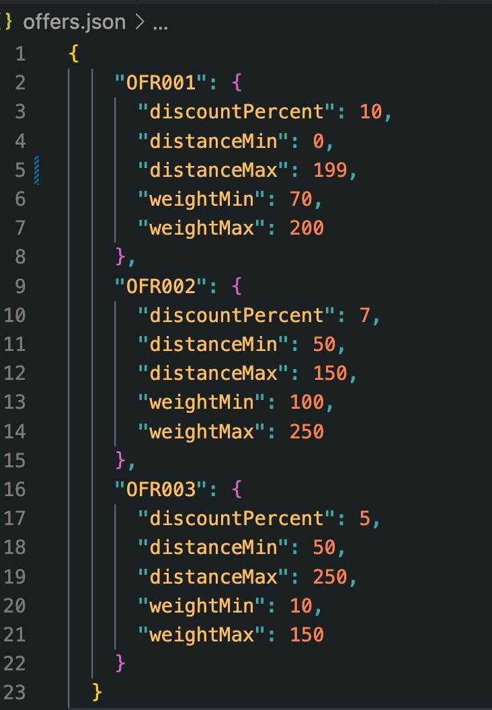

# delivery-cost-estimator
 A Node.js CLI to estimate the total delivery cost of each package with an offer code (if applicable).
 Offer codes and their criteria are defined in `offers.json` in the project directory.

---------------------------------------------------------------

## Available Scripts / Usage

In the project directory, you can run:

### `npm install`

To install required dependencies

### `node . sample.txt`

To run application with `sample.txt` as input

### `npm run test:unit`

To run unit test suites

## Dependencies
- number-precision ^1.5.2

## Dev Dependencies
- eslint ^8.19.0
- eslint-config-airbnb-base ^15.0.0
- eslint-config-standard ^17.0.0
- eslint-plugin-import ^2.26.0
- eslint-plugin-n ^15.2.4
- eslint-plugin-promise ^6.0.0
- jest ^28.1.2

---------------------------------------------------------------

### Assumptions

- It is acceptable for this MVP to use a JSON file for offers data (easily extensible for new offers). Later this would likely be handled by calling a database or an external API.

- It is acceptable to parse a text file as input instead of passing a string to STDIN. The program could easily be modified to accept a string to STDIN instead.

- Any number of package quotes may be provided in a single text file. As long as no_of_packages matches the number of package rows below.

- It is acceptable to use STDOUT as output. The program could easily be modified to write to a text file.

- Package IDs must be unique.

- The input must match the designated format exactly. It is preferable to throw errors rather than guess at the user's intention.

- If multiple offer codes are supplied in a row an error will be thrown instead of processing the first offer code only.

- Package Weight and Distance inputs are not always whole numbers

- The preferable output for discount and total is:  x (integer) or x.xx (float),  never x.x or x.xxx 

- JavaScript is linted to Airbnb style guide.

---------------------------------------------------------------

### Input/Output format

---------------------------------------------------------------

### JSON expected format
- `distanceMin` and `distanceMax` are in km 
- `weightMin` and `weightMax` are in kg

---------------------------------------------------------------

### Approach

I chose to separate concerns into the following modules: 

`index.js`

Reads the passed-in text file. Handles errors. Calls processInput, processDiscount and processOutput. Sends output to STDOUT.

`processInput`

Parses the data to create a package object (instance of the Package class) for each line of input. Checks for duplicate package IDs. Bundles these packages into a packagesObject and returns to index.js.

`processDiscount`

Calls the methods checkDiscountValid and applyDiscount on each package. Returns updated packagesObject to index.js.

`processOutput`

Calls the getSummary method on each package and returns an output string to index.js.

`Package` 

Has checkDiscountValid, applyDiscount and getSummary methods as listed above. Also has getDiscount, getTotal and getPkgID for testing purposes.

I got a MVP version of the product working, then integrated unit testing which prompted me to think about and handle the many edge cases. I refactored and reformatted code/file structure. Finally I created documentation / README.

---------------------------------------------------------------

### Improvements

- Integration Tests /  End-To-End tests. (More study required here)

- More comprehensive mocking for the unit tests. I currently mocked out the entire Package class for the tests that depend on it, but didn't create custom returns for the methods. (More study required here)

